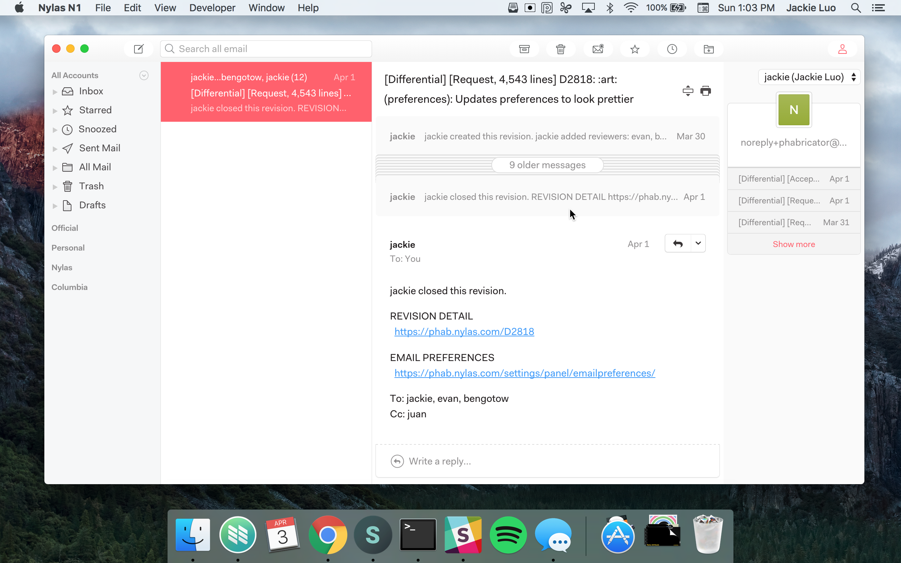

# Qamar for N1
Qamar theme for N1 Email client

## Installation
1. Download the [Nylas N1](https://nylas.com/n1) email client!
2. Download the [latest release](https://github.com/chadidi/n1-qamar/releases) of Qamar.
3. On the N1 menu, select `Nylas N1 > Install Theme...`.
4. Find the directory for this plugin to install it. :tada: